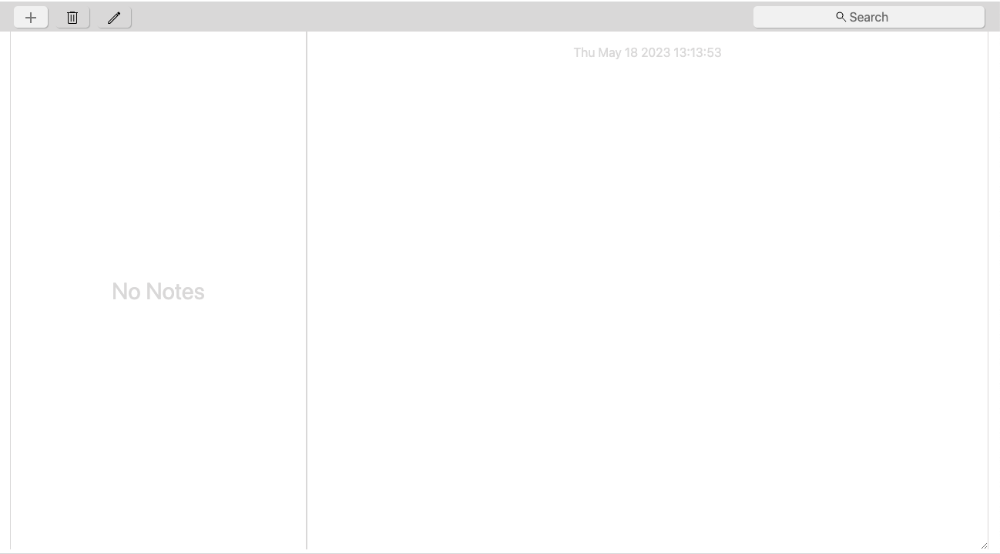
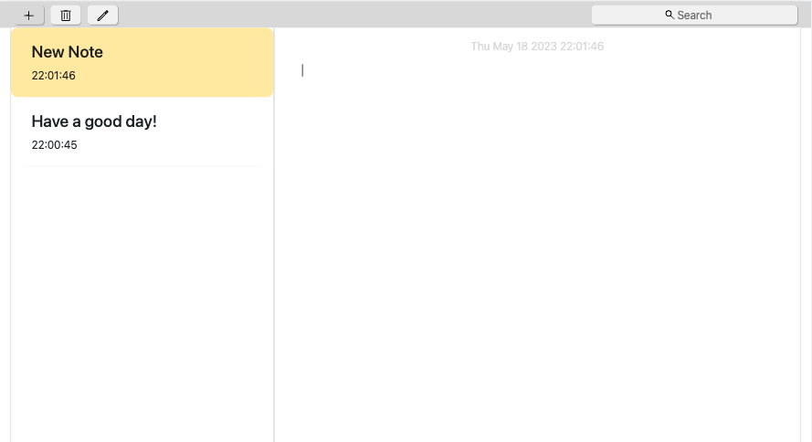
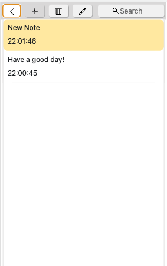

## Notes

---

Notes is the best place to jot down quick thoughts. Search for text in notes using **"Search"** input. View edit times and dates with highlighted text.
Add a new note and delete an old none by clicking to the **"+"** and **"cart"** button respectively.

**Frontend:**

**Backend:**

---

Users can either view the app at its production link or run the app locally on
their computer.

**[The production link](https://notes-app-5a0fa.web.app/)**

### How to run the app locally:

_**1.**_ Clone this repo to the computer or download a zip and unpack the archive;

_**2.**_ Open the folder at a code editor, install all dependencies using a command **"npm install"** or **"npm i"** at terminal;

_**3.**_ Run the app using a command **"npm run start"**;

_**4.**_ Please wait for the localhost to be automatically opened.

### Some screenshots and gifs from the app:

---

_**Empty notes:**_

_**Notes list:**_

_**Mobile version:**_

